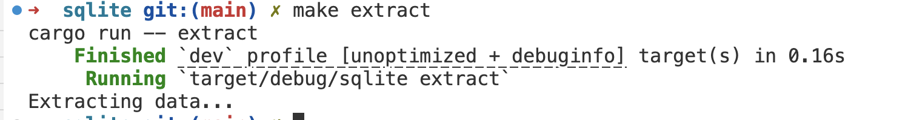
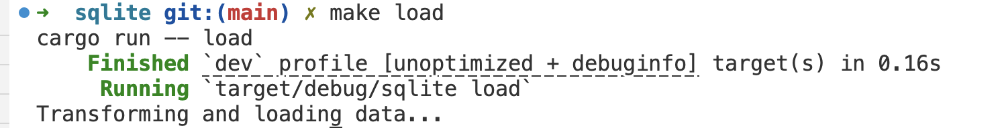
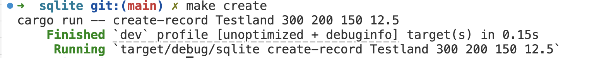
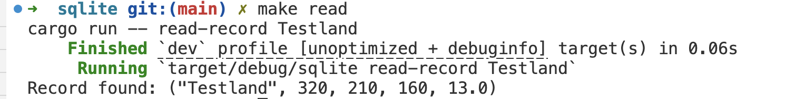
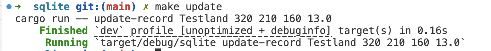
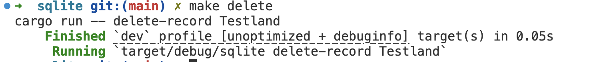
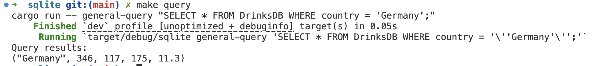
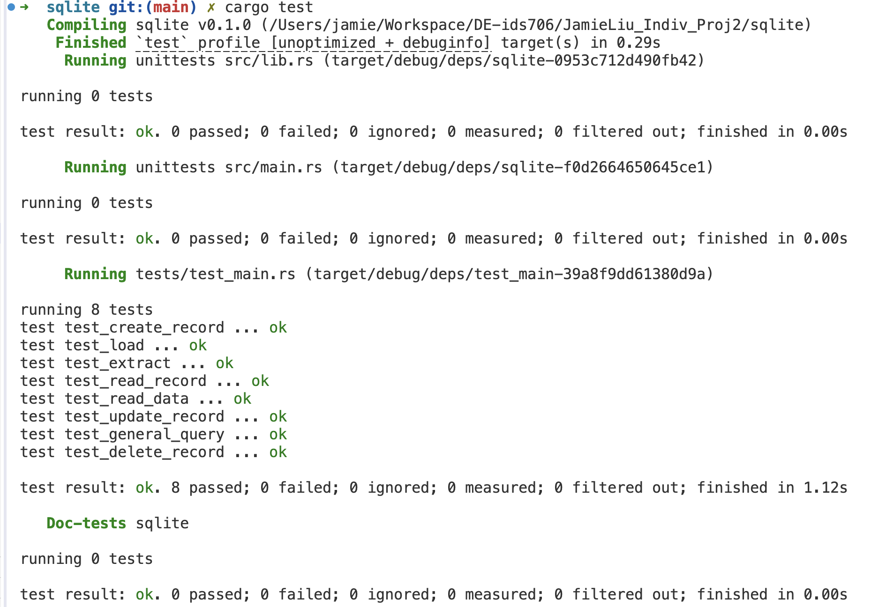
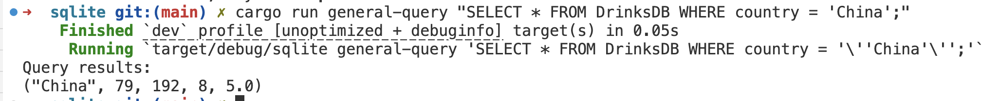

# JamieLiu_Indiv_Proj2

[](https://github.com/nogibjj/JamieLiu_Indiv_Proj2/actions/workflows/CI.yml)

## Video

https://youtu.be/Q3Tg1K7iNWI

## Drinks ETL-Query CLI Tool

This project is a Rust-based command-line interface (CLI) tool that performs ETL (Extract, Transform, Load) operations on a SQLite database of global alcohol consumption data. It allows you to extract data from a CSV file hosted online, load it into a SQLite database, and perform CRUD (Create, Read, Update, Delete) operations as well as custom SQL queries on the dataset.

## Project Structure

The project structure is organized as follows:

```
JAMIELIU_INDIV_PROJ2
├── .devcontainer
│ ├── devcontainer.json
│ └── Dockerfile
├── .github
│ └── workflows
│   └── CI.yml
├── images
├── sqlite
│ ├── data
│ ├── src
│ │ ├── lib.rs
│ │ └── main.rs
│ ├── target
│ ├── tests
│ │ └── test_main.rs
│ ├── Cargo.lock
│ ├── Cargo.toml
│ ├── DrinksDB.db
│ └── Makefile
├── .gitignore
└── README.md
```
## Project Functions

This CLI tool provides several functionalities related to ETL and database management:

1. **Data Extraction (`extract`)**: Downloads a CSV file from a specified URL and saves it locally.
2. **Data Transformation and Loading (`load`)**: Loads the extracted CSV data into a SQLite database (`DrinksDB.db`). If the table already exists, it will be dropped and recreated to ensure a fresh load.
3. **CRUD Operations**:
   - `create-record`: Adds a new record to the database with specified values for a country’s alcohol consumption metrics.
   - `update-record`: Updates the alcohol consumption data for an existing country in the database.
   - `delete-record`: Deletes a record from the database based on the country name.
   - `read-record`: Retrieves a specific record by country name, displaying only that country’s data for easier access.
   - `read-data`: Retrieves and displays all records from the `DrinksDB` table.
4. **Custom SQL Query (`general-query`)**: Allows the user to execute any custom SQL query on the `DrinksDB` table, providing flexibility for complex data retrieval or manipulation.

## Dependencies

This project uses the following Rust dependencies:

- **Rusqlite**: For interacting with SQLite databases.
- **Reqwest**: For HTTP requests to fetch CSV files.
- **CSV**: To parse CSV data files.
- **Clap**: For command-line argument parsing.

## Usage Instructions

### Setting Up

1. **Clone the Repository**:

   ```bash
   git clone git@github.com:nogibjj/JamieLiu_Indiv_Proj2.git
   ```

2. **Build the Project**:

   ```bash
   cargo build
   ```

### Running the Commands

The project includes a `Makefile` with common commands to streamline usage. You can execute each feature by using `make <command>`.

#### Makefile Commands

- **Run All Checks**:

  ```bash
  make all
  ```

- **Extract Data**:

  ```bash
  make extract
  ```

  Downloads the CSV data and saves it to `data/drinks.csv`.
  

- **Load Data**:

  ```bash
  make load
  ```

  Loads the CSV data into `DrinksDB.db`, recreating the table if it exists.
  

- **Create a Record**:

  ```bash
  make create
  ```

  Inserts a sample record for `Testland` with specific values into the database.
  

- **Read Specific Record**:

  ```bash
  make read
  ```

  Reads and displays the record for `"Testland"`.
  

- **Update a Record**:

  ```bash
  make update
  ```

  Updates the record for `Testland` with new values.
  

- **Delete a Record**:

  ```bash
  make delete
  ```

  Deletes the record for `Testland` from the `DrinksDB` table.
  

- **Read All Data**:

  ```bash
  make read-data
  ```

  Reads and displays all records in the `DrinksDB` table.

- **Execute a Custom Query**:
  ```bash
  make query
  ```
  Executes a sample custom query to retrieve data where `country = 'Germany'`. Adjust this as needed for different queries.
  

### Running Tests

To run the tests for the project, use:

```bash
cargo test
```

The tests use a dedicated test database (`TestDrinksDB.db`) to ensure production data in `DrinksDB.db` remains unaffected. This test database is created and removed at each test's start and end to maintain a clean environment.



## Custom Query Format

The `general-query` command allows users to run custom SQL queries on the `DrinksDB` table. This flexibility enables you to extract specific information or perform custom operations directly from the command line.

### Format

To run a custom query, use the following command format:

```bash
cargo run general-query "SQL_QUERY"
```

Replace `SQL_QUERY` with your actual SQL command in double quotes.

For example:

```bash
cargo run general-query "SELECT * FROM DrinksDB WHERE country = 'China';"
```



## How GitLab Copilot Assisted

GitLab Copilot provided assistance throughout the development of this project by:

- Generating initial boilerplate code for CLI commands and database functions.
- Offering suggestions for efficient Rust syntax and best practices for error handling.
- Helping to streamline repetitive coding tasks, particularly in CRUD operations and command-line parsing.

## Optimized Rust Binary

You can find and download the uploaded artifact by going to actions and clicking on the latest workflow run.
